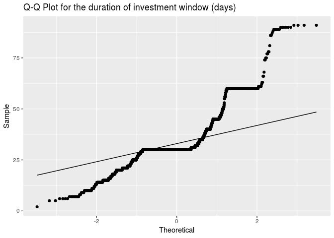
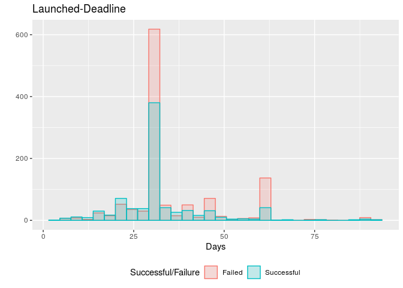

Case Study Report
================
Colin Pi, Sharan Ganjam Seshachallam
2019 2 15

Data Wrangling
--------------

``` r
# Import the Dataset
kick.2018 <- read_csv("ks-projects-201801.csv")

# Sort out failed and successful projects
kick.2018 <- kick.2018 %>% filter(state %in% c("failed", "successful")) %>% 
    mutate(diff_date = as.numeric(as.Date(deadline) - as.Date(str_extract(launched, 
        "^.{10}"))))

# Random Sampling of the Data

## index <- sample(nrow(kick.2018), 2000, replace=FALSE)

## kick.sample <- kick.2018[index, ]

## write.csv(kick.sample, file = 'Kickstarter_sample.csv', row.names = FALSE)
```

Launched-Deadline and Success/Failure
-------------------------------------

``` r
kickstarter <- read_csv("Kickstarter_sample.csv") ## pull in sample data

ggplot(kickstarter) +
  geom_histogram(aes(x = diff_date), bins = 30) +
  xlab("Days") +
  ylab("") +
  ggtitle("Launched-Deadline")
```


``` r
kickstarter$state <- factor(kickstarter$state)

failed <- subset(kickstarter, select = diff_date, subset = state == "failed", drop = T)
successful <- subset(kickstarter, select = diff_date, subset = state == "successful", drop = T)

ggplot(kickstarter, aes(x = diff_date, fill = state, color = state)) +
  geom_histogram(alpha=0.2, position="identity", bins = 30) +
  xlab("Days") +
  ylab("") +
  scale_fill_discrete(name="Successful/Failure", 
                      breaks=c("failed", "successful"), 
                      labels=c("Failed", "Successful")) + 
  scale_color_discrete(name="Successful/Failure", 
                       breaks=c("failed", "successful"), 
                       labels=c("Failed", "Successful"))+
  ggtitle("Launched-Deadline") +
  theme(legend.position="bottom")
```



``` r
ggplot(kickstarter, aes(x = state, y = diff_date, color = state)) +
  geom_boxplot() + 
  xlab("State") +
  ylab("Days") +
  scale_color_discrete(name="Successful/Failure", 
                       breaks=c("failed", "successful"), 
                       labels=c("Failed", "Successful")) +
  ggtitle("Launched-Deadline") +
  theme(legend.position="bottom") +
  coord_flip()
```



Confidence Interval
-------------------

``` r
N <- 10^4

mean.diff <- mean(failed)-mean(successful)
se <- sqrt(var(failed)/length(failed)+var(successful)/length(successful))

boot.perc <- numeric(N)
Tstar <- numeric(N)

for (i in 1:N){
  failedBoot <- sample(failed, length(failed), replace=TRUE)
  successfulBoot <- sample(successful, length(successful), replace = TRUE)
  SEstar <- sqrt(var(failedBoot)/length(failedBoot)+var(successfulBoot)/length(successfulBoot))
  meanDiffBoot <- mean(failedBoot)-mean(successfulBoot)
  Tstar[i] <- (meanDiffBoot-mean.diff)/SEstar
  boot.perc[i] <- meanDiffBoot
}

formula.t.CI <- t.test(diff_date~state, data = kickstarter)$conf
boot.perc.CI <- quantile(boot.perc, c(0.025,0.975))
boot.t.CI <- mean.diff-quantile(Tstar, c(0.975,0.025))*se
```

Formula t CI (95%): (2.07, 4.357)
Bootstrap percentile CI (95%): (2.079, 4.339)
Bootstrap t CI (95%): (2.06, 4.338)

### Hypothesis Testing

*H*<sub>0</sub> : *μ*<sub>*i**n**v**e**s**t**m**e**n**t* *w**i**n**d**o**w*,  *f**a**i**l**e**d*</sub> = *μ*<sub>*i**n**v**e**s**t**m**e**n**t* *w**i**n**d**o**w*,  *s**u**c**c**e**s**s**f**u**l*</sub>
*H*<sub>*α*</sub> : *μ*<sub>*i**n**v**e**s**t**m**e**n**t* *w**i**n**d**o**w*,  *f**a**i**l**e**d*</sub> ≠ *μ*<sub>*i**n**v**e**s**t**m**e**n**t* *w**i**n**d**o**w*,  *s**u**c**c**e**s**s**f**u**l*</sub>

``` r
pooled.data <- unlist(kickstarter$diff_date)
perm <- numeric(N)

for (i in 1:N){
  index <- sample(length(pooled.data), size = length(failed), replace = FALSE)
  perm[i] <- mean(pooled.data[index])-mean(pooled.data[-index])
}

ggplot(data.frame(perm), aes(x = perm)) +
  geom_histogram(bins = 30) +
  xlab("xbar(Failed)-xbar(Successful)") +
  ylab("") +
  geom_vline(xintercept=mean.diff, color = "red", linetype = "longdash") +
  ggtitle("Permutation distribution for difference in means")
```


``` r
p.perm <- (sum(perm >= mean.diff)+1)/(N+1)*2
p.t <- t.test(diff_date~state, data = kickstarter)$p.value
```

p-value (perm): 1.999810^{-4}
p-value (t): 4.012104710^{-8}

### Success Rate before and after 2017

``` r
kick.2018 <- kick.2018 %>% mutate(before_2017 = ifelse(launched < "2017-01-01", 
    "Yes", "No"))

before.2017 <- subset(kick.2018, select = state, subset = before_2017 == "Yes", 
    drop = T)
after.2017 <- subset(kick.2018, select = state, subset = before_2017 == "No", 
    drop = T)

succ.before.2017 <- sum(before.2017 == "successful")
succ.after.2017 <- sum(after.2017 == "successful")

prop.test(c(succ.before.2017, succ.after.2017), c(length(before.2017), length(after.2017)), 
    correct = FALSE)
```

    ## 
    ##  2-sample test for equality of proportions without continuity
    ##  correction
    ## 
    ## data:  c(succ.before.2017, succ.after.2017) out of c(length(before.2017), length(after.2017))
    ## X-squared = 93.689, df = 1, p-value < 2.2e-16
    ## alternative hypothesis: two.sided
    ## 95 percent confidence interval:
    ##  -0.02943464 -0.01946908
    ## sample estimates:
    ##    prop 1    prop 2 
    ## 0.4006772 0.4251290

We are 95% confident that in average the proportion of successful projects after 2017 is 2 to 3% higher than before 2017.
